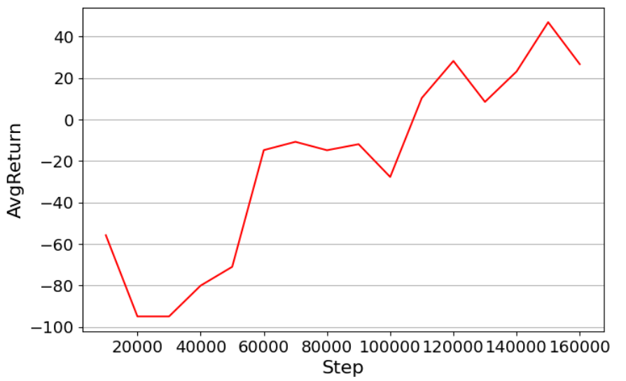
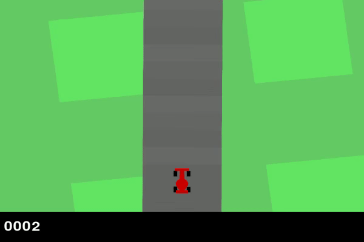

# Car racing using DQN

## Descripción general del proyecto

Este proyecto tiene como objetivo crear un agente de aprendizaje por refuerzo para el juego CarRacing-v2. El objetivo principal del agente es aprender a conducir un automóvil en una pista de carreras, maximizando la puntuación obtenida y evitando obstáculos. Este trabajo se baso en el ejemplo del siguiente ejemplo:Capstone Project – Car Racing Using DQN
 https://learning.oreilly.com/library/view/hands-on-reinforcement-learning/9781788836524/4929bee3-df49-40e9-977f-9360293ad8ed.xhtml


## Contexto del proyecto

El aprendizaje por refuerzo es un enfoque del aprendizaje automático en el que un agente interactúa con un entorno para aprender cuales son las acciones que maximizan una recompensa que se acumula en el tiempo. En este proyecto, se uso el algoritmo de aprendizaje por refuerzo DQN (Deep Q-Network) para entrenar a un agente que aprenda a conducir un automóvil de manera que este siga la pista de carreras en el juego CarRacing-v2.

Se uso el el juego CarRacing-v2, debido al que la version v0 no se encontraba disponible. Este juego, es un entorno de simulación en el que el agente controla un automóvil y debe recorrer una pista de carreras, evitando obstáculos y maximizando el puntaje obtenido. 

El enfoque utilizado en este proyecto es una combinacion de una CNN (convolutional neural network) y representacion por imagenes. La CNN usa los fotogramas pre procesados dfel juego como entrada y genera una salida que corresponde a una estimacion de los valores que corresponderan a la accion del agente. Utilizando técnicas como la memoria de repetición y la actualización recursiva, el agente aprende mejora la calidad de sus decisiones en funcion del puntaje. 

El objetivo final, es que el agente pueda conducir de forma competente un auto en el juego, superando obstaculos y maximizando su puntaje a travez del aprendizaje por refuerzo. 


## Metodología

La metodología utilizada en este proyecto consta de los siguientes pasos:

1. **Creación del entorno del juego:** Utilizando la biblioteca `gym`, se crea un entorno para el juego de carreras de autos 'CarRacing-v2'.
2. **Preprocesamiento de las imágenes:** Se procesan las imágenes del juego para convertirlas en imágenes en escala de grises de 84x84. El reescalado y el filtro de colores son necesarios para reducir el consumo de recursos de hardware. 
3. **Implementación de la red neuronal convolucional (CNN):** Se utiliza una CNN para aprender a estimar la función de valor Q (funcion de calidad. Representa la calidad de la accion tomada por el agente). Esta red toma como entrada la representación de la imagen del estado actual y proporciona una estimación de la función de valor para cada acción posible.
4. **Uso de un Buffer de Repetición:** Se almacenan las etapas que sigue el agente (estado actual, acción que ejecuta, recompensa por la accion, estado siguiente) en un buffer de repetición. Este buffer se utiliza luego para generar muestras de entrenamiento.
5. **Implementación de DQN:** Se implementa el algoritmo DQN, que utiliza la CNN para estimar la función de valor Q y seleccionar acciones, y el buffer de repetición para el entrenamiento.
6. **Evaluación del agente:** El rendimiento del agente se evalúa constantemente. Se proporciona una visualización del rendimiento del agente a lo largo del tiempo como un grafico que se actualiza cada cierto intervalo de iteraciones y que muestra la recompensa promedio a medida que avanza el entrenamiento. 




7. **Guardado del modelo:** Una vez finalizado el entrenamiento, se guarda el estado del modelo para su posterior uso.

8. **Generación de un video de la jugada:** Finalmente, se genera un video que muestra cómo juega el agente entrenado.


## Estructura del repositorio

El repositorio está organizado de la siguiente manera:

- README.md
- data
  - raw_data
  - processed_data
- notebooks
  - exploratory_analysis.ipynb
  - data_preprocessing.ipynb
  - modeling.ipynb
- src
  - data_preprocessing.py
  - model.py
- models
  - car_racingv2.ipynb
  - model.py
  - dqn_trained.pt
- reports
  - 1 - Grafico con mayor cantidad de iteraciones posibles por restricciones de hardware
  - video.mp4 - animación del comportamiento del modelo entrenado
- requirements.txt


La estructura del repositorio se organiza de la siguiente manera:

- **README.md**: Archivo que contiene información sobre el proyecto, su descripción y cualquier otra información relevante.

- **data**: Directorio que contiene los datos utilizados en el proyecto. Tiene 2 subdirectorios- raw_data para los datos sin procesar y processed_data para los datos procesados.

- **notebooks**: Directorio que contiene los notebooks utilizados en el proyecto. incluye los notebooks de análisis exploratorio, preprocesamiento de datos, modelado, entre otros.

- **src**: Directorio que contiene el código fuente del proyecto. incluye los scripts.py del proyecto.

- **models**: Directorio que contiene los modelos entrenados y el notebook con el modelo completo del proyecto. 

- **reports**: Contiene una grafica con la mayor cantidad de iteraciones que se pudieron hacer ya que la exigencia era demasiada para el hardware disponible y un video de la animacion del modelo entrenado jugando en en el entorno.

- **requirements.txt**: Archivo que enumera las dependencias del proyecto, incluyendo las versiones de las bibliotecas utilizadas.


## Dependencias

Para ejecutar este proyecto, se requiere la instalación de las siguientes bibliotecas de Python:
```python
import numpy as np
import gymnasium as gym
import matplotlib.pyplot as plt
from IPython.display import HTML
import torch
import torch.nn as nn
import torch.nn.functional as F
import matplotlib.animation as animation
import cv2
```
Para instalar las dependencias, ejecute el siguiente comando:

pip install numpy random gym opencv-python tensorflow


## Ejecución de los notebooks

Para ejecutar los notebooks de Jupyter que se encuentran en los recursos de este proyecto, se deben seguir los siguientes pasos:

1. Crear un entorno virtual (opcional): Se recomienda crear un entorno virtual antes de instalar las dependencias y ejecutar los notebooks. Esto ayudará a mantener las dependencias del proyecto separadas de otras instalaciones de Python en su sistema.

2. Instalar las dependencias: Una vez creado el entorno virtual, instale las dependencias necesarias utilizando el comando mencionado anteriormente.

3. Ejecutar los notebooks: Abra los notebooks en el entorno de Jupyter y ejecute las celdas en orden descendente. 

## Pasos seguidos y resultados obtenidos

Los pasos utilizados en este proyecto para desarrollar el agente de aprendizaje por refuerzo fueron los siguientes:

1. Se obtuvieron datos del juego del entorno CarRacing-v2, incluidas capturas de pantalla de la pantalla y las acciones del agente.

2. Los datos del juego se preprocesaron utilizando técnicas de cambio de tamaño y conversión a escala de grises para analizarlos y modelarlos posteriormente.

3. Para representar la función de valor del agente y determinar el mejor curso de acción, se implementó una arquitectura CNN llamada CNNActionValue.

4. El agente fue entrenado utilizando el algoritmo de aprendizaje por refuerzo DQN, interactuando con el entorno CarRacing-v2 y actualizando su modelo de valor en función de las recompensas recibidas.

5. La efectividad del agente no fue la esperada debido a que la cantidad de iteraciones necesarias y propuestas en el modelo de ejemplo (2e6) tomaba un estimado de 100 horas de ejecucion. Por lo tanto el modelo funciona, pero sin embargo el agente no aprende a conducir correctamente, teniendo comportamientos que no se ajustan a los esperado. Esto se corregira en futuras versiones. 

## Ejemplos reproducibles

Este código muestra cómo crear y utilizar las clases EnvWrapper, CustomLambda, QNetwork, QNetworkDueling, ReplayMemoryFast y DQN para entrenar un agente DQN en el juego CarRacing-v2. El agente utiliza una red neuronal con la arquitectura QNetworkDueling y una memoria de repetición rápida para el aprendizaje. Se muestra un ejemplo de entrenamiento del agente durante 10 episodios, con el total de recompensas por cada episodio. 

Este ejemplo se basa en la estructura y configuración previamente definidas en el proyecto. Asegúrate de tener todas las dependencias y los datos necesarios para ejecutar el código de manera adecuada.

A continuación se muestra un ejemplo del rendimiento del modelo:



## Ejemplos reproducibles

Este código muestra una secuencia de ejemplo en la que se busca clarificar los pasos seguidos en el proyecto para entrenar y evaluar un agente DQN utilizando la biblioteca Gym y el entorno de juego CarRacing-v2. A continuación se muestra un ejemplo de código para entrenar y evaluar el agente DQN en el juego CarRacing-v2:. No es el codigo completo. el modelo completo puede encontrarlo en la carpeta models del repositorio.  

```python
import numpy as np
import gym
import matplotlib.pyplot as plt
import torch
import torch.nn as nn
import torch.nn.functional as F
import cv2

# Crear el entorno CarRacing-v2
env = gym.make('CarRacing-v2', continuous=False)

# Obtener información del espacio de observación
state_space = env.observation_space
action_space = env.action_space

# Crear una CNN
class CNNActionValue(nn.Module):
    ...

# Crear un búfer de repetición 
class ReplayBuffer:
    ...

# Crear un agente DQN
class DQN:
    ...

# Crear una instancia del agente DQN
agent = DQN(state_space, action_space)

# Entrenar el agente
...

# Evaluar el agente
...

# Guardar el modelo entrenado
torch.save(agent.model.state_dict(), 'trained_model.pt')
